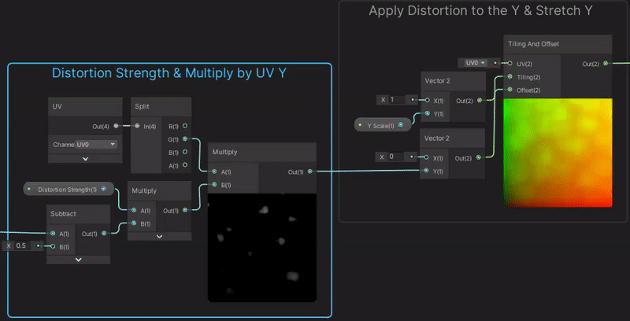
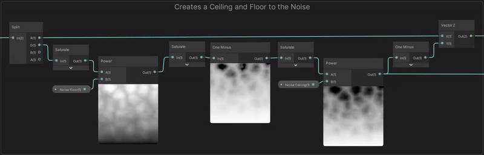
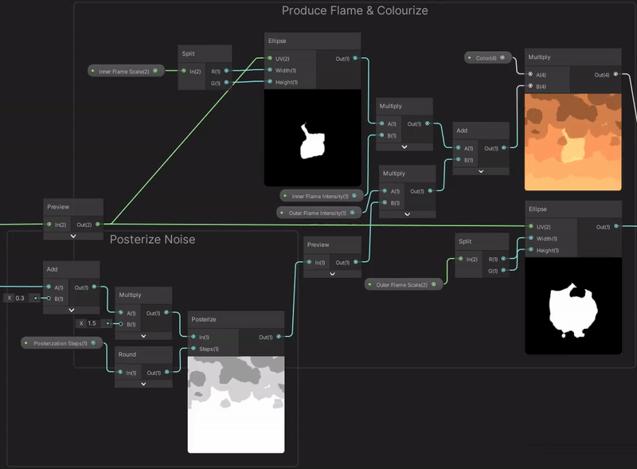

# **🔥 Stylized Fire 🔥**

---

> - Unlit shader
> - Transparent surface mode 
> - Alpha or Additive blending 

---


Procedural
Textured
Pixel Rendered



---

A common method of producing a **Fire Effect** in **Unity** is to use a **Particle System** or **VFX Graph**, however the many transparent quads used for each particle creates overdraw which can affect performance, especially for mobile platforms.

- When rendering Opaque geometry, Unity renders objects front-to-back, allowing z-testing to take place; objects obscured by closer objects have their fragments discarded from being rendered, avoiding unnecessary calculations.

- However in the Transparent queue, Unity has to render those objects back-to-front instead, in order to achieve the correct alpha blending between see through objects. 

- Rendering many objects on top of each other, like transparent quads from the particle system, can cause the Transparent queue to get overfilled and you end up rendering an overcomplex scene, reducing the overall graphics budget.

A different technique that mitigates this issue is to offset a quad's UVs, using noise, to create a fire effect. This reduces the amount of transparent objects per fire to one and also takes alot less calulations than the particle system. This technique I first saw at an Unreal Engine talk about **[RiME Stylized VFX](https://youtu.be/fwKQyDZ4ark)**.

I’ve made multiple versions of a fire shader, one a bit different from the RiME talk using the **[Simple Noise](https://docs.unity3d.com/Packages/com.unity.shadergraph@7.1/manual/Simple-Noise-Node.html)** & **[Voronoi Noise](https://docs.unity3d.com/Packages/com.unity.shadergraph@6.9/manual/Voronoi-Node.html)** nodes applied to a **[Ellipse](https://docs.unity3d.com/Packages/com.unity.shadergraph@6.9/manual/Ellipse-Node.html)** node, and the other using a seamless noise texture to offset a mask texture.

---

##### **Finished Results:**


../assets/StylizedFire/StylizedFire2.gif
../assets/StylizedFire/StylizedFire.gif
../assets/StylizedFire/PixelStylizedFire.gif

{% include elements/carousel.html height="50" unit="%" duration="5" %}

---

### **Procedural**

---

In order to create the movement needed for the **Fire Effect**, I've used the **[Time Node](https://docs.unity3d.com/Packages/com.unity.shadergraph@6.9/manual/Time-Node.html)** and **[Multiply](https://docs.unity3d.com/Packages/com.unity.shadergraph@6.9/manual/Multiply-Node.html)** it by a float to control the magnitude of the scrolling. To get the scrolling to move upwards I **[Negate](https://docs.unity3d.com/Packages/com.unity.shadergraph@6.9/manual/Negate-Node.html)** it, as the default **[Time](https://docs.unity3d.com/Packages/com.unity.shadergraph@6.9/manual/Time-Node.html)** output scrolls downwards, so the opposite is upwards. I then fed this into the Y input on a **[Vector2 Node](https://docs.unity3d.com/Packages/com.unity.shadergraph@7.1/manual/Vector-2-Node.html)**, leaving X as 0, which is used as the offset input for a **[Tiling And Offset Node](https://docs.unity3d.com/Packages/com.unity.shadergraph@6.9/manual/Tiling-And-Offset-Node.html)**, so the movement is only in the Y axis.

Also I used a **[Vector2 Property](https://docs.unity3d.com/Packages/com.unity.shadergraph@6.9/manual/Property-Types.html)** to control the scaling of the tiling input, allowing the scale of the noise to changed in the **[Inspector](https://docs.unity3d.com/Manual/UsingTheInspector.html)**. The output from our **[Tiling And Offset](https://docs.unity3d.com/Packages/com.unity.shadergraph@6.9/manual/Tiling-And-Offset-Node.html)** will then be put into a **[Simple Noise Node](https://docs.unity3d.com/Packages/com.unity.shadergraph@7.1/manual/Simple-Noise-Node.html)** and **[Voronoi Node](https://docs.unity3d.com/Packages/com.unity.shadergraph@6.9/manual/Voronoi-Node.html)**.

> `Lorem sup abor hes yohli`

This noise is used later to offset the UVs to create fire like movement. Unlike offsetting by a constant value or time (which changes, but is the same value for every UV coordinate), we are shifting each UV coordinate by a different value, which produces a distortion (aka warping) effect. We also should Subtract 0.5, so the distortion is centered and doesn’t offset more in one direction than the other.

Multiply this with a Vector1 property named Distortion Strength. We also want the top of the fire to be distorted more than the bottom, so we also Multiply with the Y axis of the UV (G output from Split). We put this result into the Y axis of a Vector2, then into the Offset input on a Tiling And Offset node to apply our distortion, only in the vertical direction.

The distortion will mean our UVs could go outside of the 0-1 range, so parts of the texture/ellipse later could be cut-off by the size of the quad. To help fix this, we’ll also include a Vector1 property called Y Scale and put it into the Y of a Vector2, with X as 1, into the Tiling input. This will allow us to scale down the effect in the vertical direction, to try to keep the fire contained to the quad.

While we could take our UVs and directly put them into an Ellipse node, I’d like to apply a bit more offset first, to warp it into a more tear-drop, or candle-flame like shape. There might be a few ways to achieve this, but I’m taking the Y axis (G output from a Split), using One Minus to flip it upside-down and putting the result into a Power node with a B value of 2. (I guess this could also just be a Multiply, not sure if the compiler is clever enough to optimise this automatically or not). The next One Minus flips the vertical component back, but since the ellipse is centered and symmetrical it shouldn’t really matter.

With our edited UVs, we’ll put them into two Ellipse nodes. The first with a Width of 0.7 and Height of 0.5, and the other with 1 and 1.

We’ll also take the output from the Power in the previous step, Add 0.3, Multiply by 1.5 and put the result into a Posterize with 3 Steps. These values were mostly trial and error to ensure the fire had a nice amount of coloured bands, to help with a more stylised look.

This is added with the smaller Ellipse output, then we can tint the fire by multiplying with a Color property (which is also set to HDR mode and has an Intensity of 1.5) and plug the result into the Color input on the Unlit Master node. Be sure to also set the surface type to Transparent via the small cog on the node.

The larger Ellipse is used as the Alpha input on the Master node if using Alpha blending. If you prefer Additive blending, Multiply this with the current colour result and use that as the Color input instead, as black areas will show as transparent.

---

### **Textured**

---

lopers













---

### **Pixel Rendered**

---

lopers